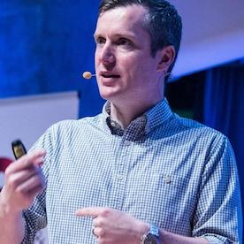

# Mobile DevOps Cloud Workshop

Welcome to the Microsoft Mobile Cloud Workshop. We've created this workshop to showcase the speed and ease at which you can leverage Microsoft' cloud platform Azure to build innovative mobile solutions.

## Guided Walkthrough

You can find a walkthrough guide for the project that outlines how you too can build and deploy your own version of the app and backend services. 

0. [Setup](Walkthrough/00_Setup/)
1. [Apps & Organizations](Walkthrough/01_Apps_&_Organizations)
2. [Visual Studio App Center SDK & Analytics](Walkthrough/02_Visual_Studio_App_Center_SDK_&_Analytics)
3. [Build & Distribution](Walkthrough/03_Build_&_Distribution)
4. [Custom Events & Crashes](Walkthrough/04_Custom_Events_&_Crashes)
5. [Automated Testing](Walkthrough/05_Automated_Testing)
6. [Push Notifications](Walkthrough/06_Push_Notifications)
7. [Visual Studio Team Services Build](Walkthrough/07_Visual_Studio_Team_Services_Build)
8. [Visual Studio Team Services Release](Walkthrough/08_Visual_Studio_Team_Services_Release)

## Support

### Where to find help

* Create GitHub issues and we'll respond as quickly as possible 
* Ping us on [Slack](https://mobilecloudworkshop.slack.com)

## Author of this guide

|               |
|:----------------------------------------------:|
|                 **Richard Erwin**                 |
|  [GitHub](https://github.com/rerwinx)  |
| [Twitter](https://twitter.com/rerwinx) |
|          [Blog](https://blogs.msdn.microsoft.com/vsappcenter/)         |

## Developers of the Contoso Maintenance App

|               |     |
|:----------------------------------------------:|:--------------------------------------------:|
|                 **Mike James**                 |            **Robin-Manuel Thiel**            |
|  [GitHub](https://github.com/MikeCodesDotNet)  | [GitHub](https://github.com/MikeCodesDotNet) |
| [Twitter](https://twitter.com/MikeCodesDotNet) | [Twitter](https://twitter.com/robinmanuelt)  |
|          [Blog](https://mikecodes.net)         |         [Blog](https://pumpingco.de/)        |

### Contributors

* **Mohamed Saif** ([GitHub](https://github.com/mohamedsaif))
* **Michael Sivers** ([GitHub](https://github.com/msivers))

## Roadmap

The current plans to update and expand this workshop are listed below.  If you would like to see something different then please let us know.

* Appium Tests
* Jenkins Build & Release
* Containerized Web API on Azure
* Azure API Management