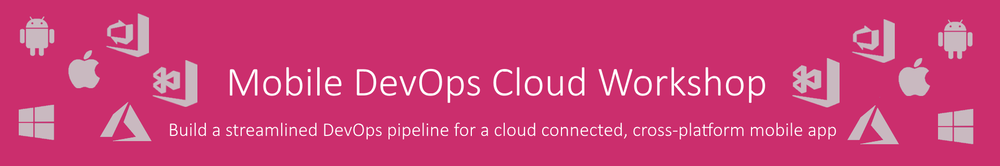

# Mobile DevOps Cloud Workshop

Welcome to the Microsoft Mobile DevOps Cloud Workshop. The workshop aims to educate and inform mobile development teams on the importance of having a streamlined DevOps pipeline and how it can be implemented using the Microsoft toolset.  Visual Studio App Center is at the core of this offering and the practical exercises will take attendees through the process of building, testing, distributing and monitoring a mobile app.    Attendees will also learn how Visual Studio Team Services can be used in conjunction with Visual Studio App Center to include a build and release process for the app backend.

## Workshop Scenario

Contoso Airlines maintenance division provides services to multiple airports. Their employees work across different sites carrying out maintenance tasks and capturing relevant data to report to HQ.  Until recently, reporting was completed using a laborious paper-based system. This process was time-consuming and error prone as captured data was manually transferred to an on-premise database when the worker returned to head office.
A cross-platform mobile app pilot has recently been completed to help accelerate these manual procedures.  However, there is some scepticism from the business about using mobile devices in their roles with users reluctant to change existing manual processes which have been in place for years.

The first release of the mobile application was well received but to be fully accepted it must be improved and expanded.  If the pilot mobile app is successful then it is likely that there will be an increased demand within the business for more apps as well as an external facing customer app too.

The newly created mobile development team in Contoso Airlines recognise that their existing tooling and processes will not scale to multiple apps and further demand from the business.  They are aware that they need to be able to iterate on the pilot app quickly to deliver additional value to users and have the agility to resolve any issues that might occur quickly.

The mobile team was assembled quickly for the pilot app and simply utilised Visual Studio 2017 as a development environment with GitHub for version control.  The process of packaging, testing and releasing the app is entirely manual which has led to early quality and stability issues on some devices as well as many late nights for the team.  The mobile team is not tied to an existing development toolset like the other internal development teams and they want to ensure that they implement a cost effective and flexible DevOps process that will allow them to integrate with other teams if required.  

## Guided Walkthrough

You can find a walkthrough guide for the project that outlines how you too can build and deploy your own version of the app and backend services. 

0. [Setup](Walkthrough/00_Setup/)
1. [Apps & Organizations](Walkthrough/01_Apps_&_Organizations)
2. [Visual Studio App Center SDK & Analytics](Walkthrough/02_Visual_Studio_App_Center_SDK_&_Analytics)
3. [Build & Distribution](Walkthrough/03_Build_&_Distribution)
4. [Custom Events & Crashes](Walkthrough/04_Custom_Events_&_Crashes)
5. [Automated Testing](Walkthrough/05_Automated_Testing)
6. [Push Notifications](Walkthrough/06_Push_Notifications)
7. [Visual Studio Team Services Build](Walkthrough/07_Visual_Studio_Team_Services_Build)
8. [Visual Studio Team Services Release](Walkthrough/08_Visual_Studio_Team_Services_Release)

## Support

### Where to find help

* Create GitHub issues and we'll respond as quickly as possible 
* Ping us on [Slack](https://mobilecloudworkshop.slack.com)

## Author of this guide

|               |
|:----------------------------------------------:|
|                 **Richard Erwin**                 |
|  [GitHub](https://github.com/rerwinx)  |
| [Twitter](https://twitter.com/rerwinx) |
|          [Blog](https://blogs.msdn.microsoft.com/vsappcenter/)         |

## Developers of the Contoso Maintenance App

|               |     |
|:----------------------------------------------:|:--------------------------------------------:|
|                 **Mike James**                 |            **Robin-Manuel Thiel**            |
|  [GitHub](https://github.com/MikeCodesDotNet)  | [GitHub](https://github.com/MikeCodesDotNet) |
| [Twitter](https://twitter.com/MikeCodesDotNet) | [Twitter](https://twitter.com/robinmanuelt)  |
|          [Blog](https://mikecodes.net)         |         [Blog](https://pumpingco.de/)        |

### Contributors

* **Mohamed Saif** ([GitHub](https://github.com/mohamedsaif))
* **Michael Sivers** ([GitHub](https://github.com/msivers))

## Roadmap

The current plans to update and expand this workshop are listed below.  If you would like to see something different then please let us know.

* Appium Tests
* Jenkins Build & Release
* Containerized Web API on Azure
* Azure API Management