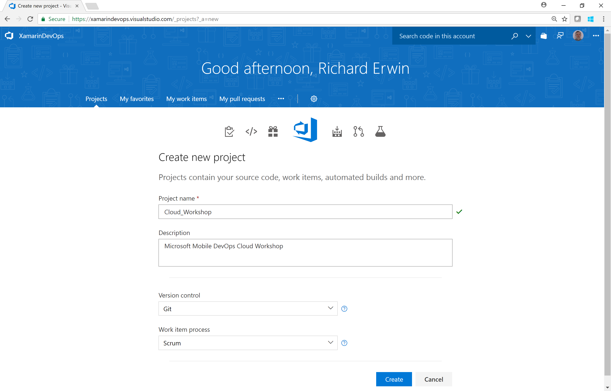

0. Setup
1. [Apps & Organizations](../01_Apps_&_Organizations)
2. [Visual Studio App Center SDK & Analytics](../02_Visual_Studio_App_Center_SDK_&_Analytics)
3. [Build & Distribution](../03_Build_&_Distribution)
4. [Custom Events & Crashes](../04_Custom_Events_&_Crashes)
5. [Automated Testing](../05_Automated_Testing)
6. [Push Notifications](../06_Push_Notifications)
7. [Visual Studio Team Services Build](../07_Visual_Studio_Team_Services_Build)
8. [Visual Studio Team Services Release](../08_Visual_Studio_Team_Services_Release)

# Exercise 00: Setup
The labs can be complete for both iOS and Android but it is advisable to pick one to complete during the workshop.  
You will need:
### [For iOS:]( https://blogs.msdn.microsoft.com/vsappcenter/three-quick-tips-signing-your-ios-apps-with-visual-studio-app-center-build/) 

* Apple Developer Account
* .mobileprovision file
* .p12 file

### For Android

* Keystore file (this can be generated from Visual Studio/Android Studio)

**Important**: If you are using Visual Studio 2015 or 2017 then ensure you have installed the Xamarin tools which are not part of a default installation.  

[Installing Xamarin in Visual Studio on Windows](https://developer.xamarin.com/guides/cross-platform/getting_started/installation/windows/)  
[Visual Studio App Center Docs](https://docs.microsoft.com/en-us/appcenter/)

## Task 1: Clone the Mobile DevOps Repo

Create a new Visual Studio Team Services project (you can also use GitHub for Version Control if you prefer)

Navigate to the VSTS Code hub and Import the following repo to Visual Studio Team Services (or Fork to GitHub)  
https://github.com/MikeCodesDotNet/Mobile-Cloud-Workshop.git 

The repo is public and will not require authorization

**Important! Use the _DevOps_ Repo for all exercises**

## [Optional] Task 2: Deploy the backend services

This step is optional to begin the lab.  You can make use of a pre-deployed version of the mobile backend which consists of the following Azure services:-

* Cosmos DB
* Web API
* Azure Function
* ChatBot
* Cognitive Services

Detailed instructions are available here:

https://github.com/MikeCodesDotNet/Mobile-Cloud-Workshop/tree/master/Walkthrough%20Guide/00_Setup 

[**TODO**] Deploy ARM Template instructions

[**TODO**] Deploy Function, ChatBot, WebAPI via Visual Studio 
[Can we use DevOps projects?]
