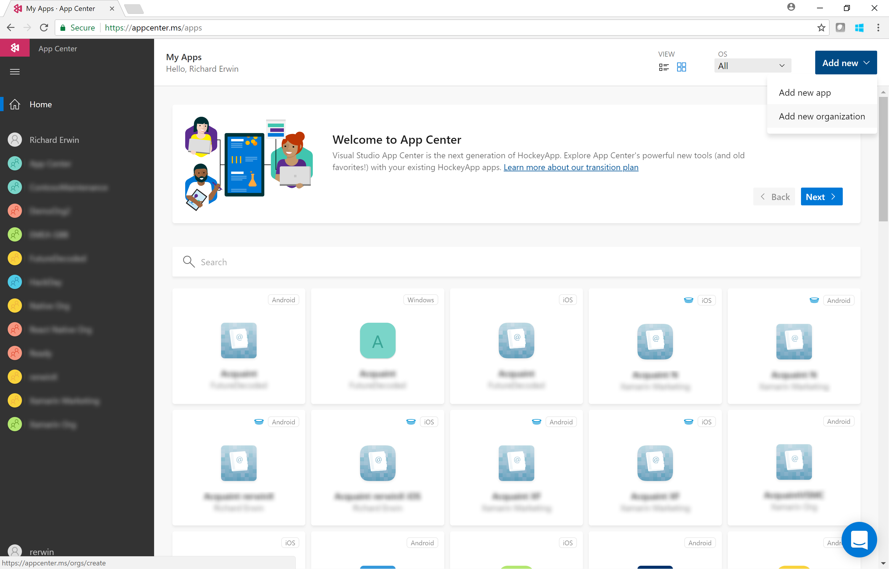
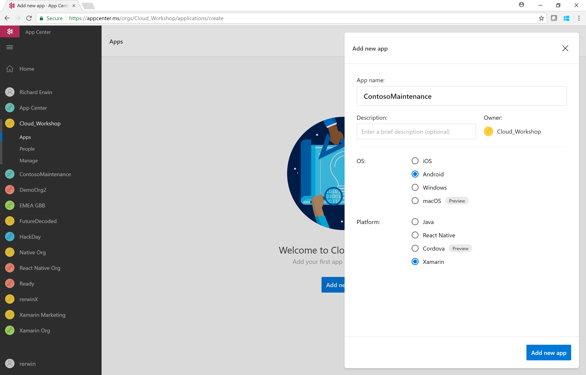

0. [Setup](../00_Setup/)
1. Apps & Organizations
2. [Visual Studio App Center SDK & Analytics](../02_Visual_Studio_App_Center_SDK_&_Analytics)
3. [Build & Distribution](../03_Build_&_Distribution)
4. [Custom Events & Crashes](../04_Custom_Events_&_Crashes)
5. [Automated Testing](../05_Automated_Testing)
6. [Push Notifications](../06_Push_Notifications)
7. [Visual Studio Team Services Build](../07_Visual_Studio_Team_Services_Build)
8. [Visual Studio Team Services Release](../08_Visual_Studio_Team_Services_Release)

# Exercise 01: Visual Studio App Center Apps & Organizations  
_Duration: 30 minutes_  
_Docs: https://docs.microsoft.com/en-us/appcenter/dashboard/creating-and-managing-organizations_  
_https://docs.microsoft.com/en-us/appcenter/dashboard/creating-and-managing-apps_  

In this exercise you will create an Organization group and an App placeholder in Visual Studio App Center which will be used for all future exercises.

## Task1: Create an Organization

Create a new Organization in the Visual Studio App Center home screen (**Add new** button on top right hand side of screen).  This Organization will allow us to easily add and restrict access to developers and testers of our app.

## Task 2: Create a Visual Studio App Center App

Within the Organization created in Task 1, create a new app which will target the OS you will focus on for the lab exercises (iOS or Android).  Choose Xamarin as the target Platform.

Within your new app, browse the services available on the menu bar.
