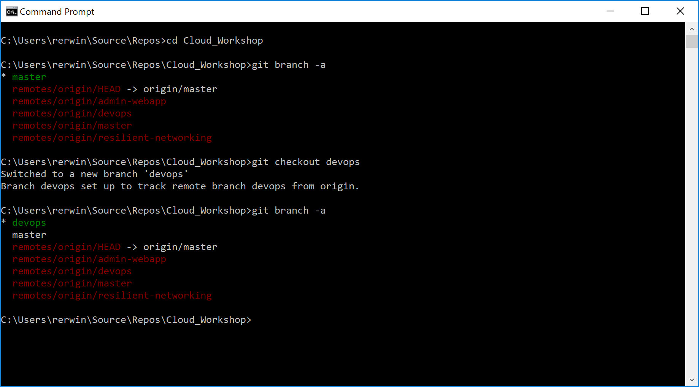

0. [Setup](../00_Setup/)
1. [Apps & Organizations](../01_Apps_&_Organizations)
2. Visual Studio App Center SDK & Analytics
3. [Build & Distribution](../03_Build_&_Distribution)
4. [Custom Events & Crashes](../04_Custom_Events_&_Crashes)
5. [Automated Testing](../05_Automated_Testing)
6. [Push Notifications](../06_Push_Notifications)
7. [Visual Studio Team Services Build](../07_Visual_Studio_Team_Services_Build)
8. [Visual Studio Team Services Release](../08_Visual_Studio_Team_Services_Release)

# Exercise 02: The Visual Studio App Center SDK  
__Duration: 45 minutes__  
__Docs: https://docs.microsoft.com/en-us/appcenter/sdk/getting-started/xamarin#3-add-the-app-center-sdk-to-your-solution__  
__https://docs.microsoft.com/en-us/appcenter/analytics/overview__   

In this exercise you will include the Visual Studio App Center SDK in your Xamarin app. As soon as the application is used, analytics will begin to flow into your App Center portal.

## Task 1: Clone the repo locally 

Clone the DevOps branch of the repo to your local machine.  You can do this via Visual Studio or Command Line.

## Task 2: Switch to the ‘DevOps’ branch in the repo

Once you have the source locally, switch to the devops branch.  Again this can be completed via command line or Visual Studio.

## Task 3: Add App Center NuGet Packages

Open the **ContosoMaintenance** solution and navigate to the **ContosoFieldService.Core** project. 

> Mobile – Forms – ContosoFieldService.Core – App.Xaml.cs

Include the latest stable version of the following NuGet Packages

* Microsoft.AppCenter.Crashes
* Microsoft.AppCenter.Analytics
* Microsoft.AppCenter.Push

Open the file:

> Mobile – Forms – ContosoFieldService.Core – App.Xaml.cs

Include the using statements in **App.Xaml.cs**

> using Microsoft.AppCenter;  
> using Microsoft.AppCenter.Analytics;  
> using Microsoft.AppCenter.Crashes;

## Task 4: Start App Center SDK

In the **OnStart()** method in **App.Xaml.cs** add the following line, substituting the app secret for your chosen platform. Replace everything including the braces.

>AppCenter.Start("android={Your Android App Secret};" + "uwp={Your UWP App secret here};" + "ios={Your iOS App secret here}", typeof(Analytics), typeof(Crashes));

## Task 5: Review Analytics 

Launch your app in Visual Studio on an iOS Simulator, Android Emulator or a physical device attached to your computer.

Navigate to the Analytics – Log Flow section of your app in App Center.  You should see information flowing to the portal after a short period.

Note: The line **environment.IsRunningInRealWorld()** will exclude AppCenter for Debug builds and Emulator/Simulator runs.  If you are not running the app on a physical device then call **AppCenter.Start()** outside the **if()** statement.

You should also be able to see your user session in the **Analytics – Overview** section of the portal.

## Task 4: Commit code and push to origin.

Pushing your code changes can be completed in Visual Studio, command line or the Git client of your choice.
