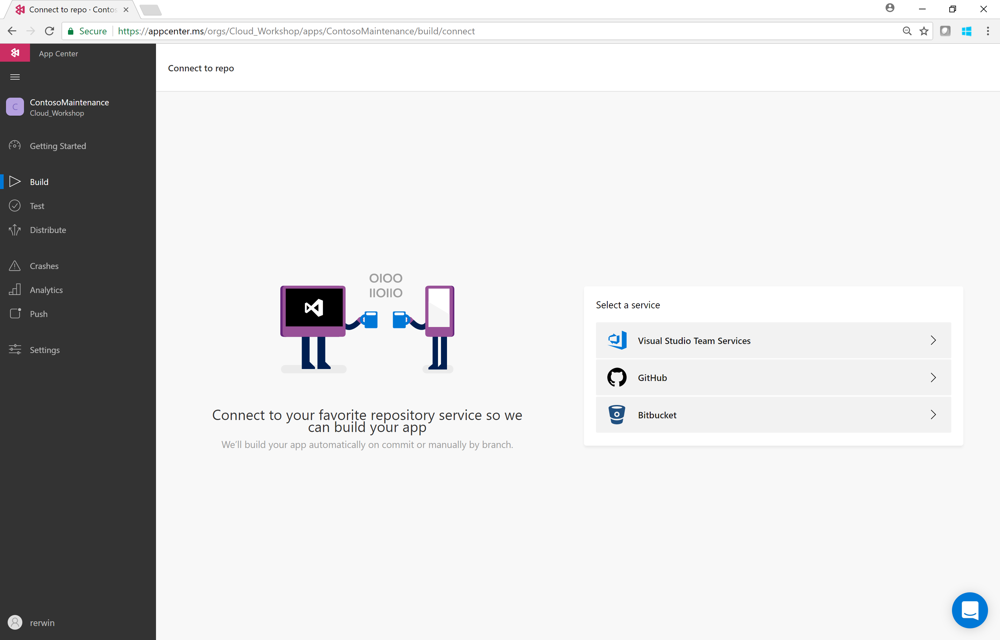
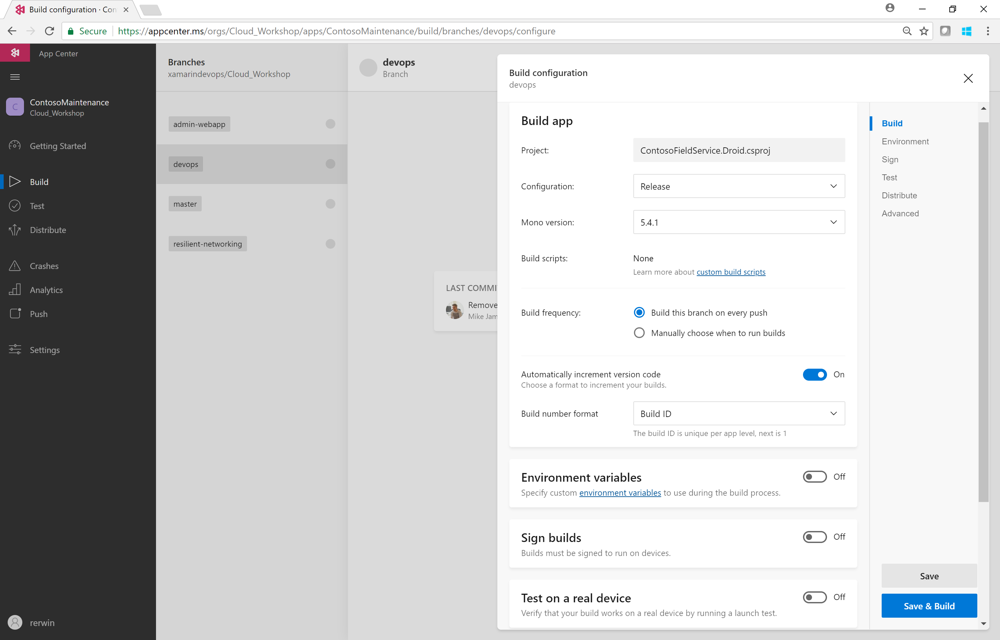
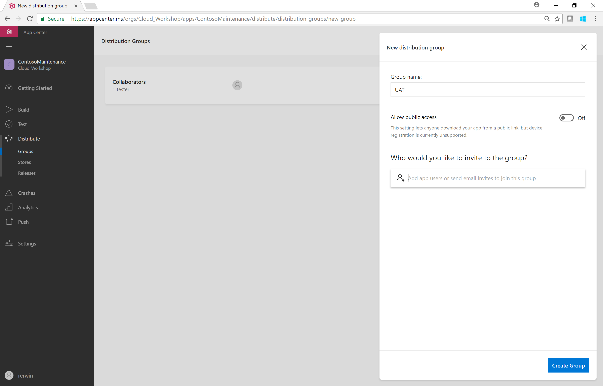
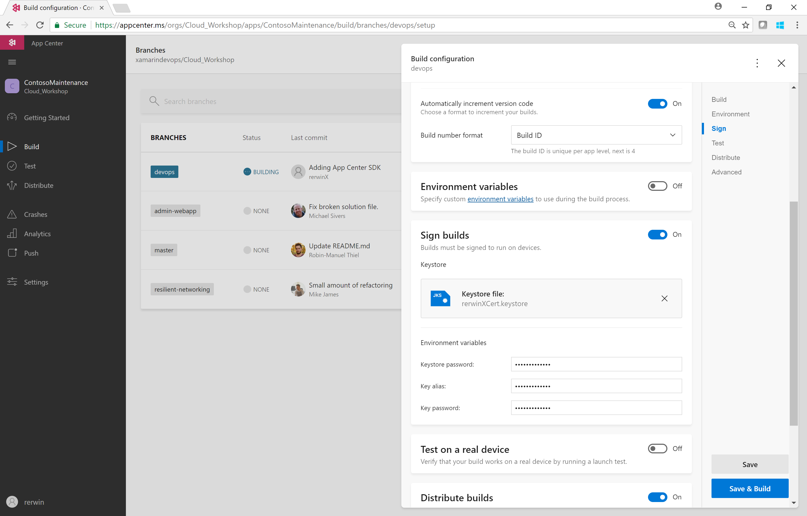

0. [Setup](../00_Setup/)
1. [Apps & Organizations](../01_Apps_&_Organizations)
2. [Visual Studio App Center SDK & Analytics](../02_Visual_Studio_App_Center_SDK_&_Analytics)
3. Build & Distribution
4. [Custom Events & Crashes](../04_Custom_Events_&_Crashes)
5. [Automated Testing](../05_Automated_Testing)
6. [Push Notifications](../06_Push_Notifications)
7. [Visual Studio Team Services Build](../07_Visual_Studio_Team_Services_Build)
8. [Visual Studio Team Services Release](../08_Visual_Studio_Team_Services_Release)

# Exercise 03: Build & Distribution
_Duration: 30 minutes_  
_Docs: https://docs.microsoft.com/en-us/appcenter/build/_  

In this exercise you will use Visual Studio App Center to set up a simple Continuous Integration process.  You will then expand that process to sign and distribute the app as well as creating a simple launch test on a physical cloud hosted device.

## Task 1: Connect the VSTS repo

In the Visual Studio App Center build service, connect the build to your Visual Studio Team Services repo.  This will interrogate the repo to user stand the branching structure.

## Task 2: Create a basic build definition on DevOps branch

In the App Center Build Service, connect the Visual Studio Team Services repo set up at the beginning of the workshop.
Configure a Release build for the DevOps branch
Set it to:

* Release Configuration
* Build this branch on every push
* Automatically increment the version code (Android) or build number (iOS) using the App Center Build ID

Save & Build the DevOps branch.

## Task 3: Create a Distribution Group 

Now we have a basic build process, we can expand on this to sign and distribute the app.  

Select the **Distribute** service in the App Center portal and create a new Distribution Group using the **New Group** button on the top right of the portal.

You can name the group anything but typical uses might be for Testers, UAT or Stakeholders.  Invite some additional users if you wish.  You also have the choice to make this group public which would permit anonymous downloads of the app.

## Task 4: Update build – Sign, Distribute, Launch Test 

Return to the build definition you created in Step 1 and edit it to add signing information and distribute it to your new Group.

_For Android you will need your .keystore file along with the Alias and Password._  
_For iOS you will need the provisioning profile which includes your device (.mobileprovision), a Certificate (.p12) and Password._

* Switch on Sign Builds and enter your signing details
* Switch on Test on a real device
* Switch on Distribute build and choose your new distribution group

