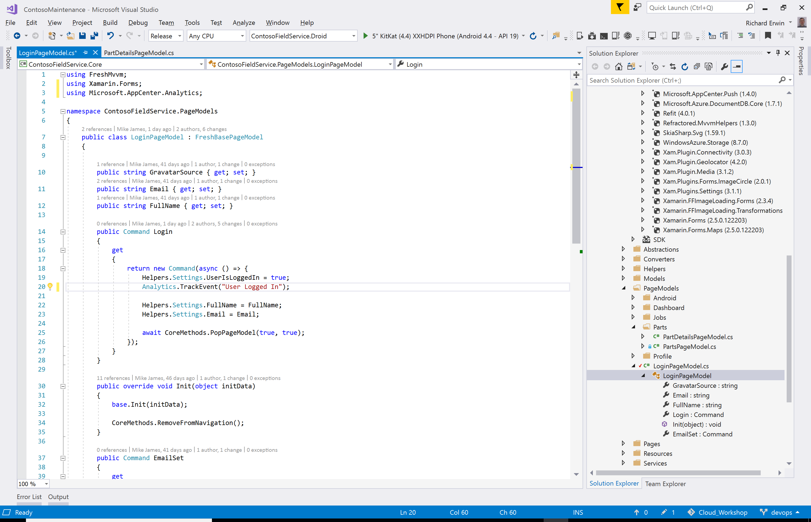
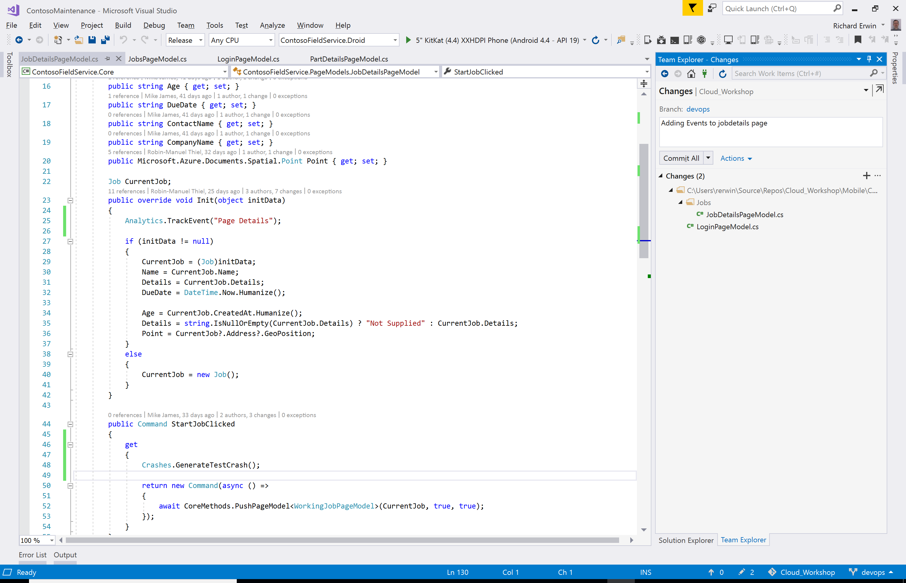

0. [Setup](../00_Setup/)
1. [Apps & Organizations](../01_Apps_&_Organizations)
2. [Visual Studio App Center SDK & Analytics](../02_Visual_Studio_App_Center_SDK_&_Analytics)
3. [Build & Distribution](../03_Build_&_Distribution)
4. Custom Events & Crashes
5. [Automated Testing](../05_Automated_Testing)
6. [Push Notifications](../06_Push_Notifications)
7. [Visual Studio Team Services Build](../07_Visual_Studio_Team_Services_Build)
8. [Visual Studio Team Services Release](../08_Visual_Studio_Team_Services_Release)

# Exercise 04: Custom Events & Crashes
_Duration: 30 minutes_  
_Docs: https://docs.microsoft.com/en-us/appcenter/analytics/event-metrics_   
_https://docs.microsoft.com/en-us/appcenter/crashes/_ 

In this exercise you will and some custom events to the app which will track the app usage and allow you to make intelligent decisions about development areas to focus on.  In addition you will generate a crash and review the event breadcrumbs which led to that problem.

## Task 1: Add Custom Events to the app

You can add as many events to the app as you like but at a minimum add some to the page models for some of the pages (eg. LoginPageModel.cs).
Add the Analytics using statement in the page you are targeting.

using Microsoft.AppCenter.Analytics;

An Event can be a simple note

> Analytics.TrackEvent(“User logged in”);

Or can be augmented with additional contextual information

> Analytics.TrackEvent("Video clicked", new Dictionary<string, string> {

> { "Category", "Music" },

> { "FileName", "favorite.avi"}

> });

At this stage you can launch your app again and discover event data being pushed to Visual Studio App Center in the **Analytics – Events** service.

## Task 2: Simulate a Crash

Crashes and Unhandled Exceptions will occur and will be monitored by Visual Studio App Center.  For this exercise you will use the built in

> AppCenter.Crashes.GenerateTestCrash();

Again, this can be added anywhere in the app to simulate an issue but a good place is in the **JobDetailsPageModel.cs** where you can add it to the **StartJobClicked()** method

## Task 3: Review the crash information

Launch your app and navigate through to the location of the crash.

Relaunch the app and after a short period data will be sent back to Visual Studio App Center.

View the Crash, including the stack trace and then drill into the individual test report.  This will show the event breadcrumbs and more details about the device which encountered the problem.