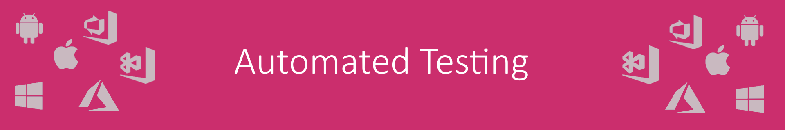
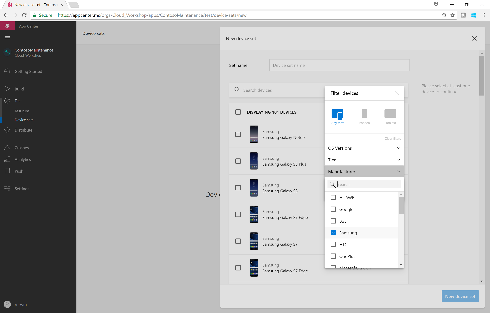
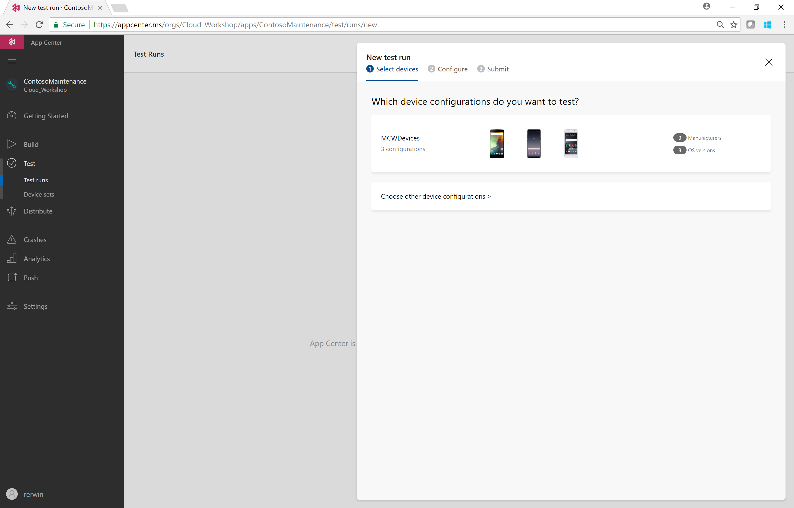
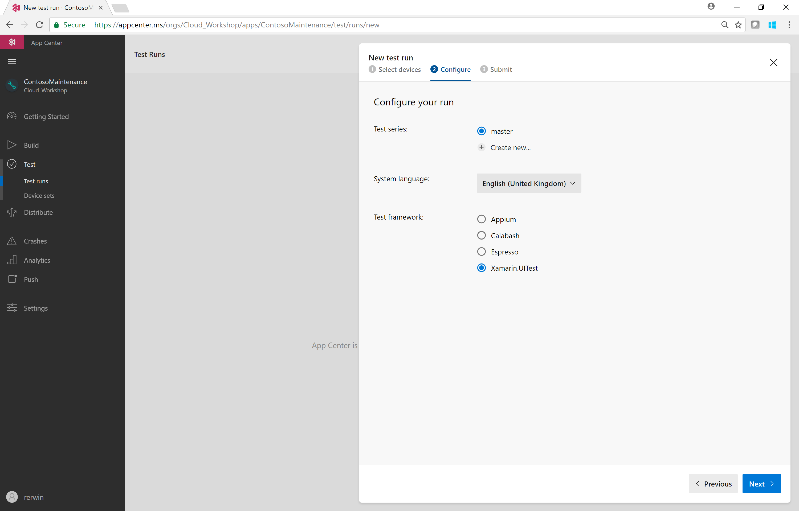
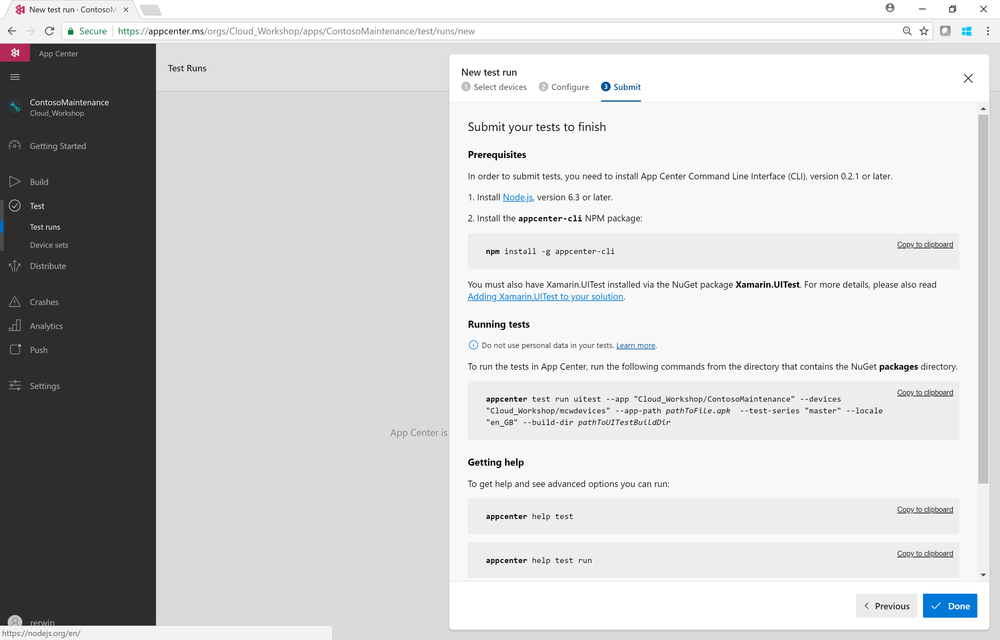
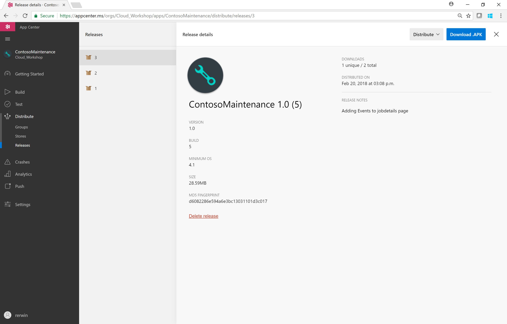
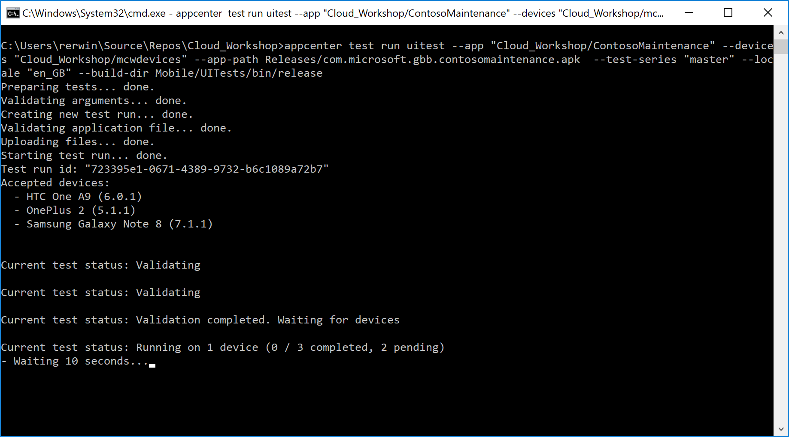
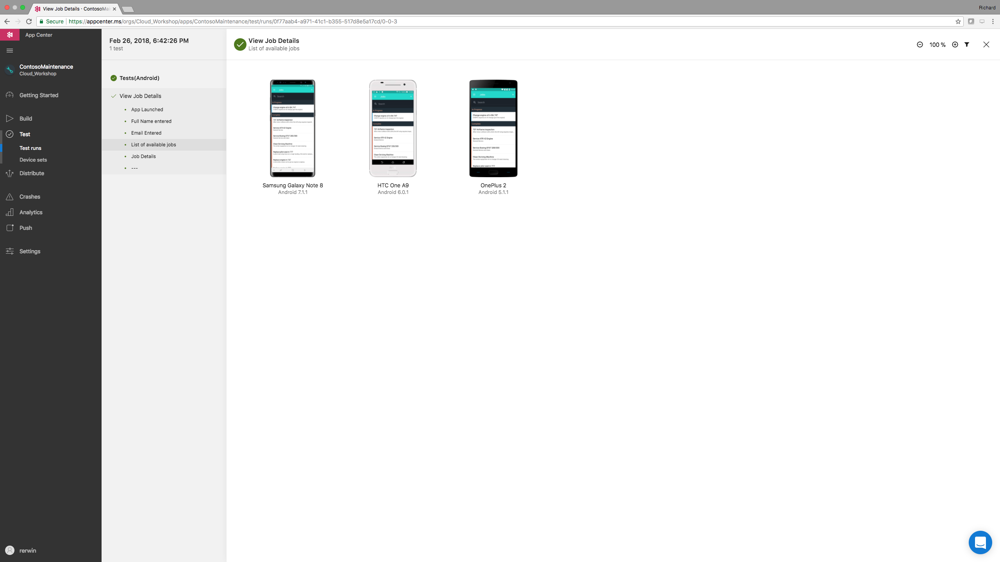

0. [Setup](../00_Setup/)
1. [Apps & Organizations](../01_Apps_&_Organizations)
2. [Visual Studio App Center SDK & Analytics](../02_Visual_Studio_App_Center_SDK_&_Analytics)
3. [Build & Distribution](../03_Build_&_Distribution)
4. [Custom Events & Crashes](../04_Custom_Events_&_Crashes)
5. Automated Testing
6. [Push Notifications](../06_Push_Notifications)
7. [Visual Studio Team Services Build](../07_Visual_Studio_Team_Services_Build)
8. [Visual Studio Team Services Release](../08_Visual_Studio_Team_Services_Release)

# Exercise 05: Automated Test
_Duration: 30 minutes_  
_Docs: https://docs.microsoft.com/en-us/appcenter/_  
_https://developer.xamarin.com/guides/testcloud/uitest/intro-to-uitest/_

## Task 1: Create a simple test 

Firstly we need to create an automated test for the app and the first choice is the Test Framework we wish to use.

| Test Framework  | Language | iOS  | Android |
| :---: | :---: | :---: | :---: |
| Appium | Java  | X  | X  |
| Calabash  | Ruby  | X  | X  |
| Espresso  | Java  |   | X  |
| Xamarin.UITest  | C#  | X  | X  |
| XCUITest  | Objective-C/Swift  | X  |   |

For this exercise we will use Xamarin.UITest which is a great choice for Xamarin solutions due to the ease of use and integration with Visual Studio.

You can use this simple test to launch the app, login and perform a basic check on the Job Details page.
Add the test to:

> Mobile/Forms/Test/ContosoFieldService.UITests/Tests.cs

    [Test]
    public void ViewJobDetails()
    {
        //Arrange

        string strFullName = "Mike James";
        string strEmail = "mike@xamarin.com";

        //Act

        /* Wait for a login element to appear on the screen.
         * This will also synchronize screenshots.
         * Using the Marked query targeting the element AutomationID so the
         * test will mostly work cross platform.
        */
        app.WaitForElement(x => x.Marked("tbxFullname"));

        // Taking more screenshots than normal for demo purposes
        app.Screenshot("App Launched");

        // Enter Username
        app.EnterText(x => x.Marked("tbxFullname"), strFullName;
        app.Screenshot("Full Name entered");

        // Enter Email
        app.EnterText(x => x.Marked("tbxEmail"), strEmail);
        app.Screenshot("Email Entered");

        // Tap the Login button
        app.Tap(x => x.Marked("btnLogin"));

        /* Wait for the jobs listo appear.
        * If no jobs are in the database, the test will throw a timeout exception
        */
        AppResult[] jobs = app.WaitForElement(x => x.Marked("lblName"));
        app.Screenshot("List of available jobs");

        // Tap the first job on the list
        app.Tap(x => x.Marked("lblName").Index(0));
        app.WaitForElement(x => x.Marked("btnStartJob"));
        app.Screenshot("Job Details");

        // Assert

        // Query the job details page and make sure the title is not empty
        AppResult[] results = app.Query(x => x.Marked("lblDetailsTitle"));
        Assert.IsNotEmpty(results[0].Text);
        }

## Task 2: Create a Device Set

**You will need to activate the 30 day trial of the test functionality in your Visual Studio App Center account** 

Now we have a test to work with, we need to choose the set of devices we wish to execute the test on.  In the App Center portal chooses *Test – Device Sets*

Give the Device Set a name and filter the device list.  Choose 3 devices to execute your test on, while you can choose more, the trial will provide you with limited device concurrency meaning that if you select a large number of devices, it will take significant time to complete.

## Task 3: Create a new Test Run and install the App Center CLI

In the App Center portal, select **Test – Test Runs** and create a **New Test Run**.

Select the device set you created in Task 2.

Configure your test run with the following settings:

* System Language = English (United Kingdom)
* Test Framework = Xamarin.UITest

You will be presented with instructions to install the Visual Studio App Center Command Line Interface using the node package manager (npm) which you may need to install first.

> npm install -g appcenter-cli

## Task 4: Submit test to Visual Studio App Center via Command Line

Open a command prompt/terminal window and navigate to the directory containing the Contoso Maintenance solution file.

If you haven’t already got a copy, download a release of the app (.apk or .ipa) from **Distribute – Releases** and store it in a folder called Releases.

**Important** – for iOS, it must be a **Debug** build of the app.

The exact command line will vary but will look something like this:
> appcenter test run uitest --app "Cloud_Workshop/ContosoMaintenance" --devices "Cloud_Workshop/mcwdevices" --app-path Releases/com.microsoft.gbb.contosomaintenance.apk  --test-series "master" --locale "en_GB" --build-dir Mobile/UITests/bin/release

As your tests completed on each device, you can review the results in **Test – Test Runs**

