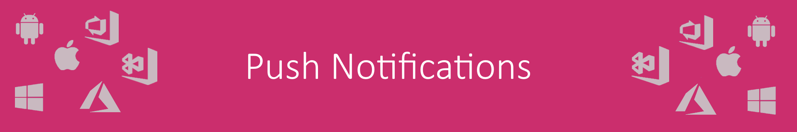
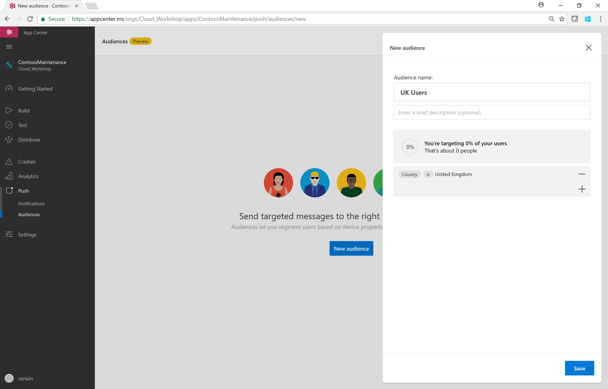
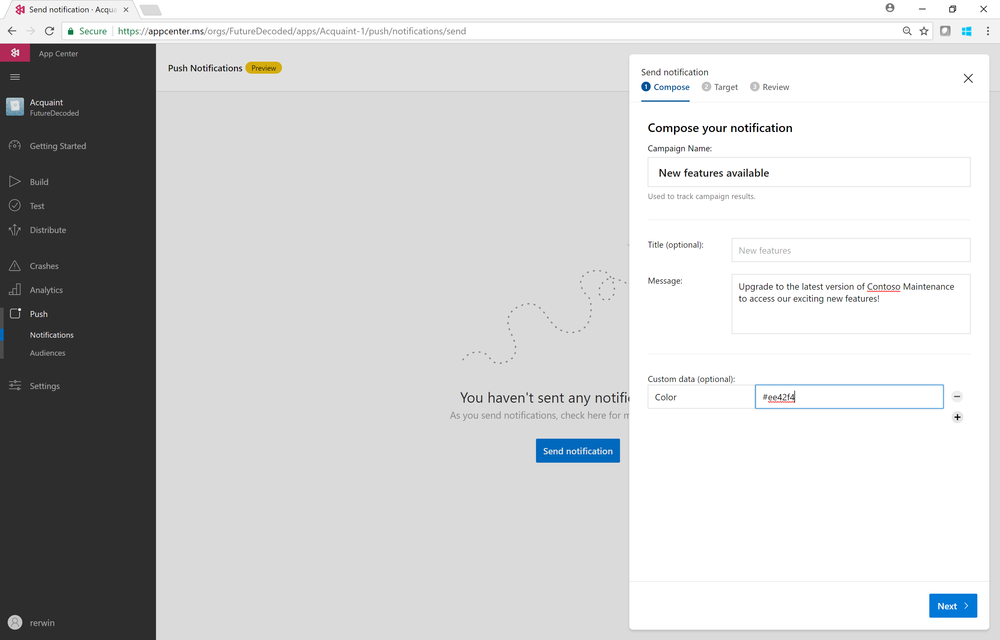

0. [Setup](../00_Setup/)
1. [Apps & Organizations](../01_Apps_&_Organizations)
2. [Visual Studio App Center SDK & Analytics](../02_Visual_Studio_App_Center_SDK_&_Analytics)
3. [Build & Distribution](../03_Build_&_Distribution)
4. [Custom Events & Crashes](../04_Custom_Events_&_Crashes)
5. [Automated Testing](../05_Automated_Testing)
6. Push Notifications
7. [Visual Studio Team Services Build](../07_Visual_Studio_Team_Services_Build)
8. [Visual Studio Team Services Release](../08_Visual_Studio_Team_Services_Release)

# Exercise 06: Push Notifications
_Duration: 30 minutes_  
_Docs: https://docs.microsoft.com/en-us/appcenter/push/_

In this exercise you will add the ability to communicate with your users via push notifications.  You will target audiences using different segmentations eg. Device Manufacturer, Screen Size or App Version.

## Task 1: Configure the messaging service

The steps to complete the push notification configuration are different for each platform.
iOS Apple Push Notifications: https://docs.microsoft.com/en-us/appcenter/sdk/push/ios 
Android Firebase Cloud Messaging: https://docs.microsoft.com/en-us/appcenter/sdk/push/android 

## Task 2: Create a simple Audience 

Navigate to **Push – Audiences** and create a new Audience group.
Choose some rules which will target your device e.g. **Country = United Kingdom** or **OEM = Samsung**.
Save the Audience

## Task 3: Send a push notification to the Audience

Navigate to **Push – Notifications** and 

**[TODO]**

## [Optional] Task 4: Construct a custom app property and target with a push notification

**[TODO]**

https://docs.microsoft.com/en-us/appcenter/sdk/other-apis/ios#use-custom-properties  
https://docs.microsoft.com/en-us/appcenter/sdk/other-apis/android#use-custom-properties
