0. [Setup](../00_Setup/)
1. [Apps & Organizations](../01_Apps_&_Organizations)
2. [Visual Studio App Center SDK & Analytics](../02_Visual_Studio_App_Center_SDK_&_Analytics)
3. [Build & Distribution](../03_Build_&_Distribution)
4. [Custom Events & Crashes](../04_Custom_Events_&_Crashes)
5. [Automated Testing](../05_Automated_Testing)
6. [Push Notifications](../06_Push_Notifications)
7. Visual Studio Team Services Build
8. [Visual Studio Team Services Release](../08_Visual_Studio_Team_Services_Release)

# Exercise 07: Visual Studio Team Services Build  
_Duration: 45 minutes_

In this exercise you will recreate the Visual Studio App Center build in Visual Studio Team Services.  This will give you more control and flexibility over your mobile build although it does require some additional work.  You will also create a build for your backend Azure services.

## Task1: Prepare Visual Studio Team Services: Add a Visual Studio App Center connection

Before we can replicate the App Center mobile build in Visual Studio Team Services, we need to make some changes that we will use later.  Firstly we need to make a connection between the two tools.

Navigate to the App Center portal, click on your account name at the bottom right of the screen and select **Account Settings**

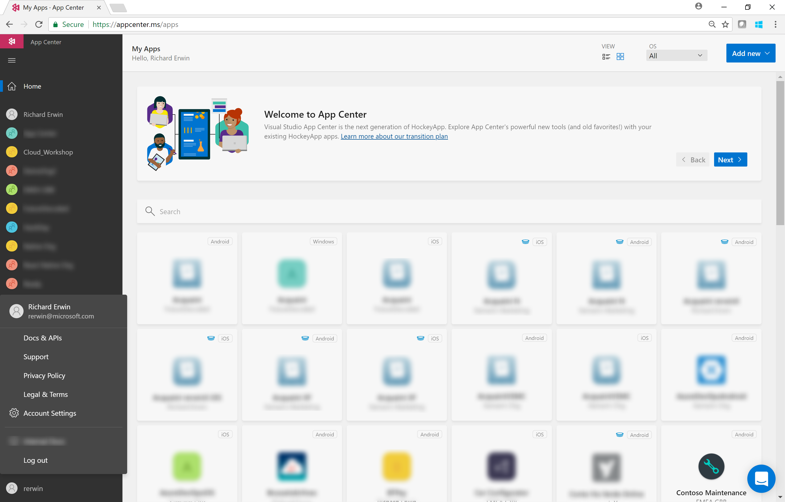

In **Account Settings** select **API Tokens**

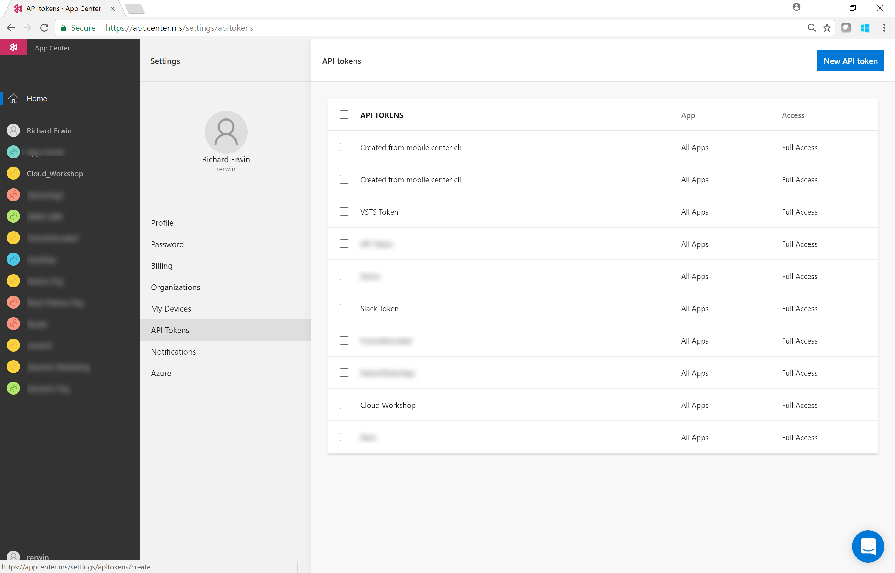

Click **New API Token**, give the Token a name (so you remember what it's being used for) and provide it **Full Access** (VSTS needs to publish to App Center and invoke test runs)

On the next screen, copy the token and store it somewhere as you cannot see the Token again in the App Center portal once this dialog has been dismissed.

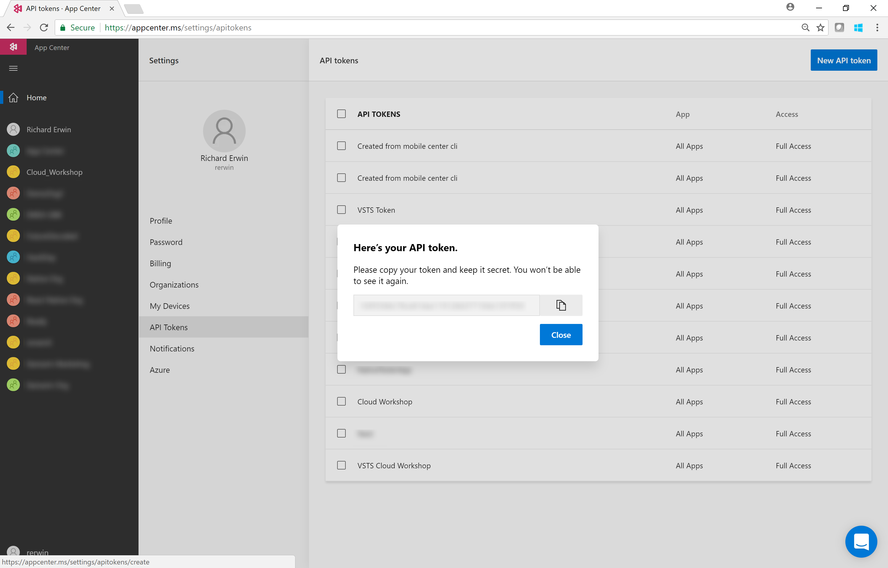

Now, go back to the Visual Studio Team Services portal and click **Settings - Services**

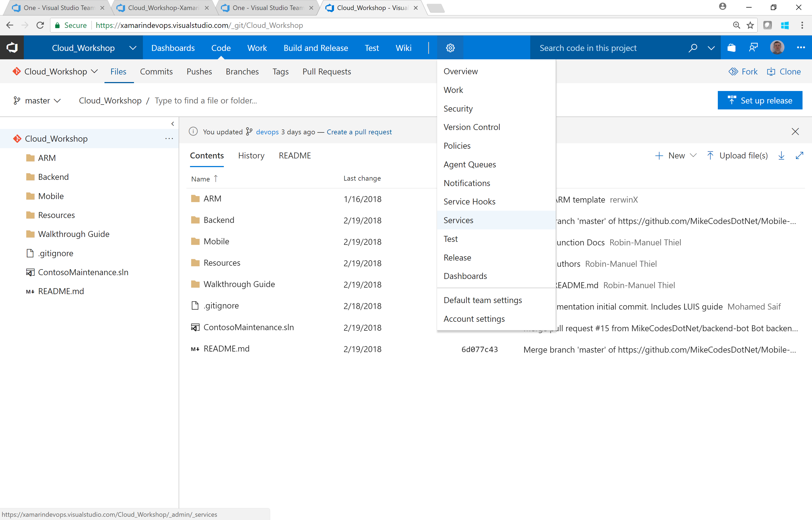

Create a **New Service Endpoint** and select **Visual Studio Team Services** from the list.

In the **Add new Visual Studio App Center Connection** dialog, give the connection a memorable name and paste in the API Token you created earlier

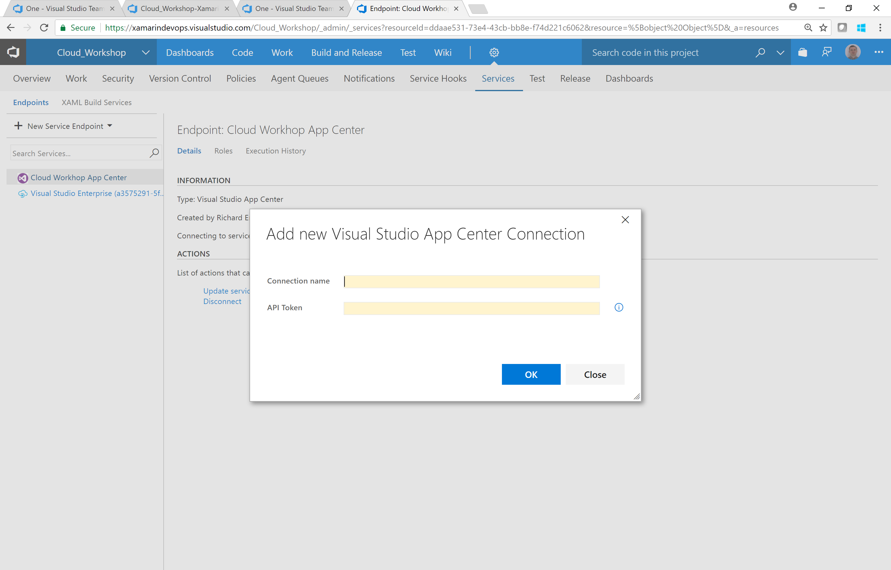

## ~~Task2: Prepare Visual Studio Team Services: Add certificates to secure file library~~

**Note** 

v2 of the Android Signing build Task allows you to upload a Secure File directly from the Task making this step unnecessary.

On iOS, the upload can be completed directly from the **Download Secure File** Task.

~~In the Visual Studio Team Services portal, navigate to **Build and Release – Library – Secure Files**~~

~~Click **+Secure File** and choose the required files to sign the app for your chosen platform~~

* ~~Android: .keystore~~
* ~~iOS: .mobileprovision,.p12)~~

## Task3: Recreate the mobile build for your chosen platform

Navigate to your Visual Studio Team Services project and select the **Build and Release** hub.

Create a new **Build Definition** and select the following:

* Source = VSTS Git
* Branch = DevOps

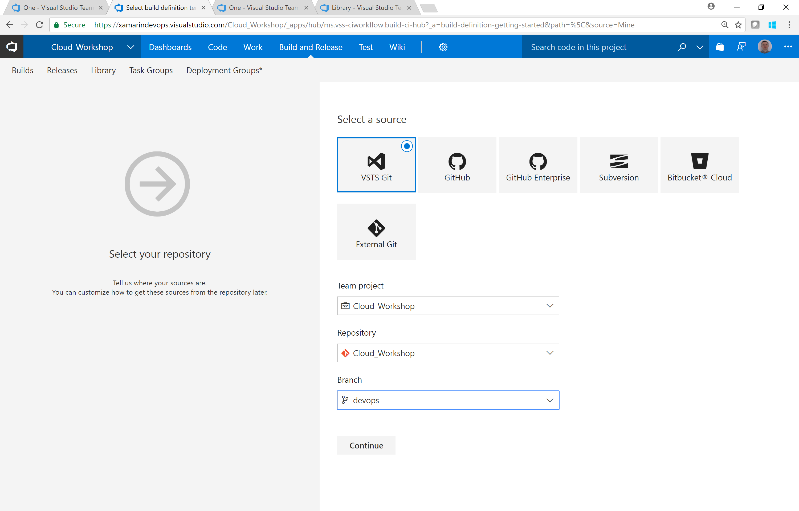

Hit **Continue**

At this point we could select a **Xamarin.iOS** or **Xamarin.Android** build definition or start from an  **Empty Process** and build it up from nothing.

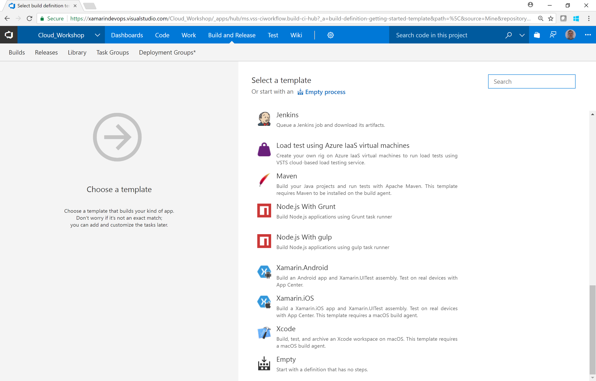

In the interests of time, let's start with a pre-configured build definition and amend it as necessary.  Choose between iOS and Android in the section below.

### Android

Choose a new **Android.Xamarin** build definition from the list and hit **Apply**.

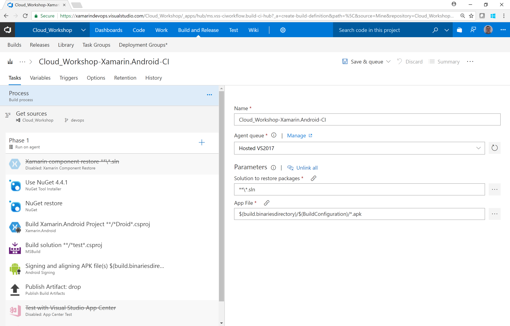

Remove the already disabled **Xamarin Component Restore** Task

Add the following required Tasks by clicking the **+** button next to **Phase 1**.  You will have to download from the Visual Studio Marketplace.

* Android Manifest Version Numbers - Install [Mobile App Tasks for iOS and Android](https://marketplace.visualstudio.com/items?itemName=vs-publisher-473885.motz-mobile-buildtasks)
* ~~Download Secure File~~ (This is not needed with v2 of the Android Signing Task)

The final order of the Tasks in your build definition should look like this:

* NuGet Tool Installer
* NuGet
* Download Secure File
* Android Manifest Version Numbers
* Xamarin Android
* MSBuild
* Android Signing
* Publish Artifatct Drop
* App Center Test
* App Center Distribute (We will move this to a Release process later)

Now we can start filling in the required information

#### Process

* Agent Queue = Hosted MacOS preview (iOS or Android)
* Solution to restore packages = ContosoMaintenance.sln
* App File = $(build.binaresdirectiry)/$(BuildConfiguration)/com.microsoft.gbb.contosomaintenance.apk

#### Download Secure File

* Secure File = [yourfilename].keystore

#### Android Manifest Version Numbers

* Android Manifest File Path = Mobile/Droid/Properties/AndroidManifest.xml

#### Build Xamarin.Android Project

* Project = Mobile/Droid/ContosoFieldService.Droid.csproj

#### MSBuild (for UI Tests)

* Project Mobile/UITests/ContosoFieldService.UITests.csproj

#### Android Signing

* Sign the APK = true
* Keystore file = Choose .keystore file from drop down or upload a file now
* Keystore Password = [Your password]

**Note** passwords can be added to the **Variables** tab and encrypted with the **lock icon**.  The are then referenced in build steps via **$(VariableName)**

* Alias = [Your Keystore Alias]
* Key Password = [Your Alias password]
* ZipAlign = true

#### App Center Test

* Prepare Tests = true
* Test Framework = Xamarain UI Test
* Build Directory = $(build.binariesdirectory)/$(BuildConfiguration)/test-assembly
* Test Tools Directory = $(Build.SourcesDirectory)/packages/Xamarin.UITest.*/tools
* Run Tests = true
* Authentication Method = App Center Connection
* App Center Connection = [Choose the connection you created in Step 1]
* App Slug = This will be in the form Organization/App from Exercise 01. eg. Cloud_Workshop/ContosoMaintenance
* Devices = This will be in the form Organization/DeviceSet from Exercise 05. eg. Cloud_Workshop/MCWDevices
* System Language = English (United Kingdom)

#### App Center Distribute

* App Center Connection = [Choose the connection you created in Step 1]
* App Slug = This will be in the form Organization/App from Exercise 01. eg. Cloud_Workshop/ContosoMaintenance
* Create Release Notes = Enter Release Notes
* Release Notes = New drop of Contoso Maintenance (This can be whatever you wish or you could specify a Release Note file)

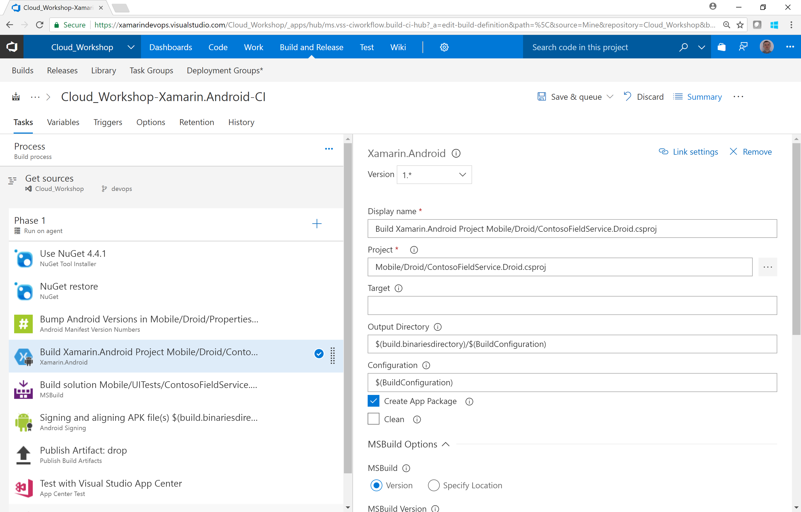

**Save and Queue** a build ensuring we are targeting the **DevOps** branch.

### iOS

Choose a new **Android.iOS** build definition from the list and hit **Apply**.

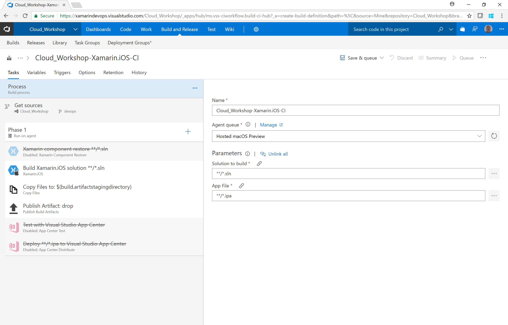

Remove the already disabled **Xamarin Component Restore** Task

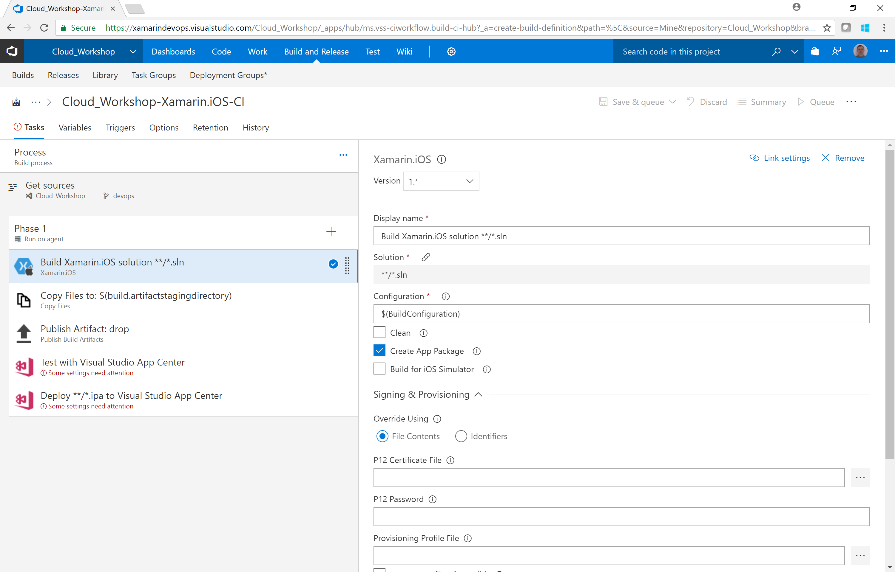

Add the following required Tasks by clicking the **+** button next to **Phase 1**.  You will have to download from the Visual Studio Marketplace.

* iOS Version Numbers - Install [Mobile App Tasks for iOS and Android](https://marketplace.visualstudio.com/items?itemName=vs-publisher-473885.motz-mobile-buildtasks)
* Download Secure File

The final order of the Tasks in your build definition should look like this:

* NuGet Tool Installer
* NuGet
* Download Secure File (.p12)
* Download Secure File (.mobileprovision)
* iOS Bundle Version Numbers
* Xamarin iOS
* MSBuild
* Copy Files
* Publish Build Artifacts
* App Center Test
* App Center Distribute (We will move this to a Release process later)

Now we can start filling in the required information

Add the following Tasks in this order:

### Process

* Agent Queue = Hosted macOS Preview
* Solution to build = Mobile/iOS/ContosoFieldService.iOS.csproj

### NuGet
* Path to solution, packages.config, or project.json = ContosoMaintenance.sln

### Download Secure File

* Secure File = [yourfilename].p12  

Upload the file here if you have not already

### Download Secure File

* Secure File = [yourfilename].mobileprovision

Upload the file here if you have not already

### iOS Bundle Version Numbers

* iOS info.plist File Path = Mobile/iOS/Info.plist

### Xamarin.iOS

* Solution = Mobile/iOS/ContosoFieldService.iOS.csproj
* Create App Package = true
* P12 Certificate File = $(Agent.WorkFolder)/_temp/[YourFilename].p12
* P12 Password = [Your Password]

**Note** passwords can be added to the **Variables** tab and encrypted with the **lock icon**.  The are then referenced in build steps via **$(VariableName)**

* Provisioning Profile File = $(Agent.WorkFolder)/_temp/[YourFilename].mobileprovision
* Advanced - Run NuGet Restore = False
* Advanced - Build Tool = MSBuild(Visual Studio for Mac)

### MSBuild

Project = Mobile/UITests/ContosoFieldService.UITests.csproj
MSBuild Arguments = /p:OutputPath = "$(build.binariesdirectory)/$(BuildConfiguration)/test-assembly"

#### App Center Test

* Prepare Tests = true
* Test Framework = Xamarain UI Test
* Build Directory = $(build.binariesdirectory)/$(BuildConfiguration)/test-assembly
* Test Tools Directory = $(Build.SourcesDirectory)/packages/Xamarin.UITest.*/tools
* Run Tests = true
* Authentication Method = App Center Connection
* App Center Connection = [Choose the connection you created in Step 1]
* App Slug = This will be in the form Organization/App from Exercise 01. eg. Cloud_Workshop/ContosoMaintenance
* Devices = This will be in the form Organization/DeviceSet from Exercise 05. eg. Cloud_Workshop/MCWDevices
* System Language = English (United Kingdom)

#### App Center Distribute

* App Center Connection = [Choose the connection you created in Step 1]
* App Slug = This will be in the form Organization/App from Exercise 01. eg. Cloud_Workshop/ContosoMaintenance
* Create Release Notes = Enter Release Notes
* Release Notes = New drop of Contoso Maintenance (This can be whatever you wish or you could specify a Release Note file)

**Save and Queue** a build ensuring we are targeting the **DevOps** branch.

## [Optional] Task 4: Tokenise the build

In this step we will use VSTS build parameters to substitute the App Center App Secret at build time.
There are many tasks in the marketplace to help with Tokenization

* [Replace Tokens](https://marketplace.visualstudio.com/items?itemName=qetza.replacetokens)
* [Tokenizer](https://marketplace.visualstudio.com/items?itemName=4tecture.Tokenizer)
* [Total ALM Tokenization](https://marketplace.visualstudio.com/items?itemName=TotalALM.totalalm-tokenization)
* [Colin's ALM Corner Build & Release Tools](https://marketplace.visualstudio.com/items?itemName=colinsalmcorner.colinsalmcorner-buildtasks) (Personally, I use this one)

The core concept is described here: [Using VSTS Release with tokenisation to deploy websites](http://blogs.ripple-rock.com/rorystreet/2015/11/25/UsingVSTSReleaseWithTokenisationToDeployWebsites.aspx)

## Task 5: Create a Web API Build

**Note** The process is the same for Azure Functions and Bots so we will complete a build and deploy process for only one of the Backend components

Create a new **Build Definition** and select the following:

* Source = VSTS Git
* Branch = DevOps

Hit **Continue**

Choose an **Azure Web App** Build Definition

 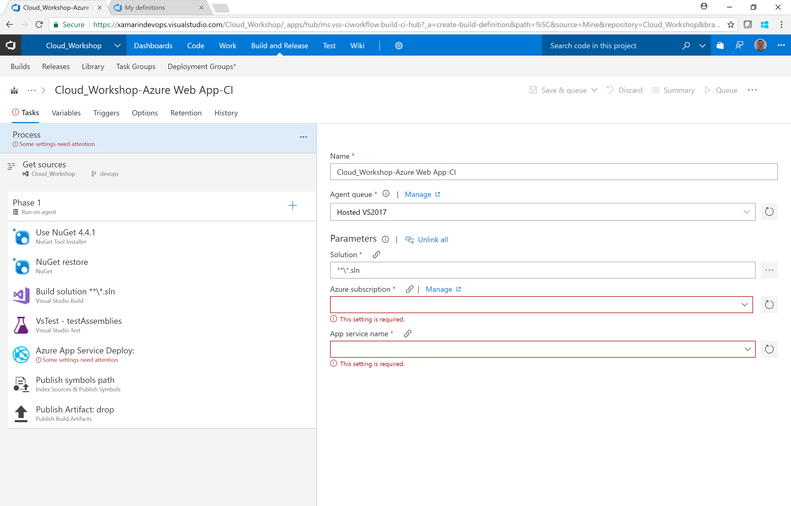

Remove the following tasks:

* Visual Studio Test(We do not have any web api tests)
* Azure App Service Deploy (We will deploy through a VSTS Release)

Complete the Task details

### Process

* Agent Queue = Hosted VS2017
* Solution  = Unlink all (we will specify separately in each task)

### NuGet

* Path to solution, packages.config, or project.json = ContosoMaintenance.sln

### Visual Studio Build

* Solution = Backend/Monolithic/ContosoMaintenance.WebAPI.csproj

**Save and Queue** a build ensuring we are targeting the **DevOps** branch.

In the completed build report summary, you can click on Artifacts - Explore and view the WebDeploy package for the Web API project that we will deploy in the next exercise.

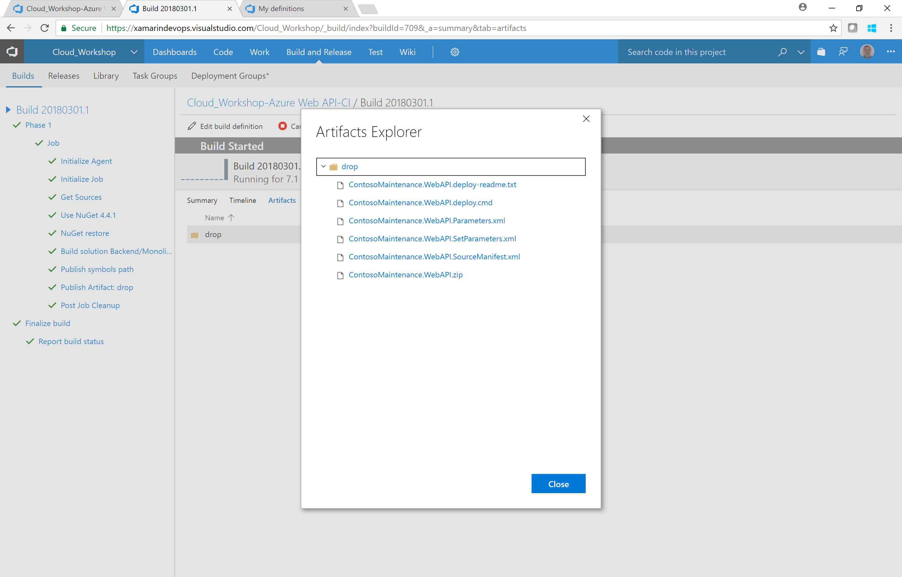

[Continuous Integration using Visual Studio Team Services](https://almvm.azurewebsites.net/labs/vsts/continuousintegration)