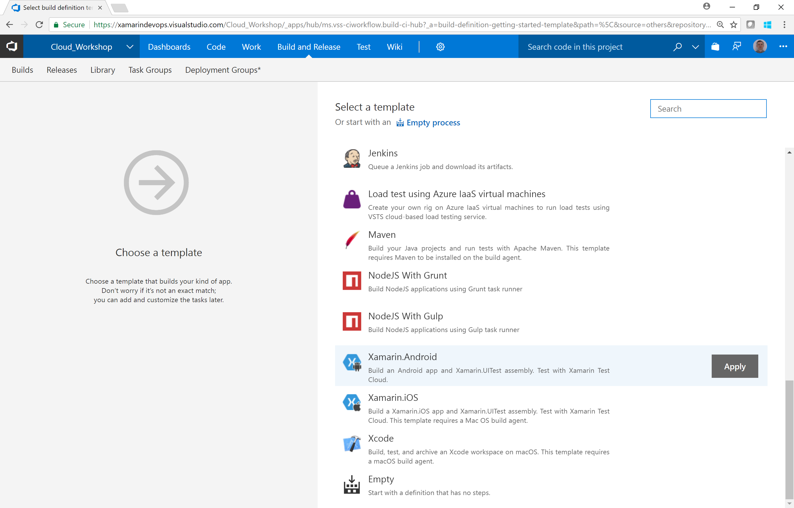
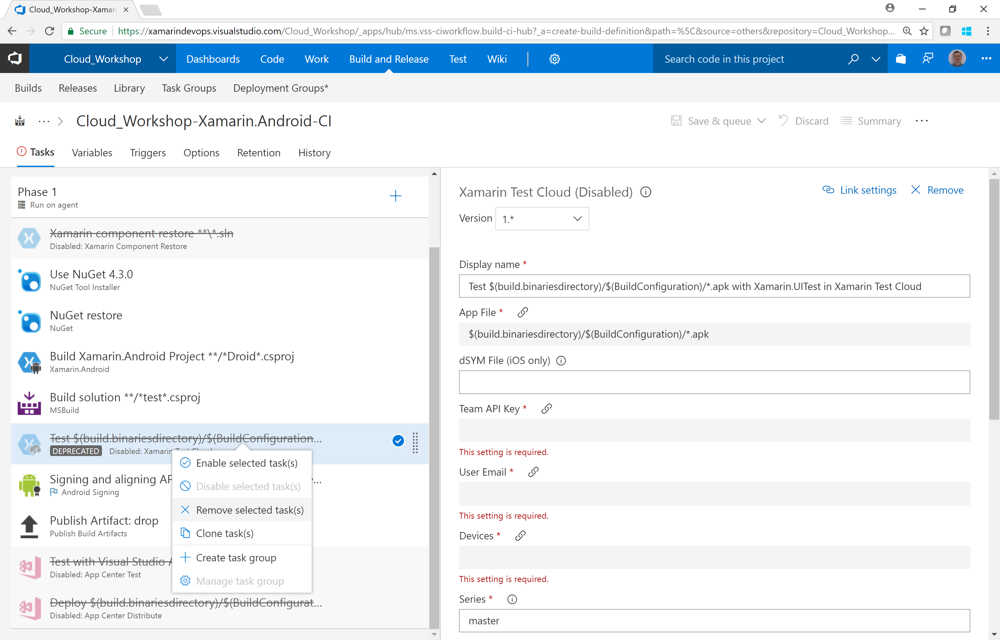
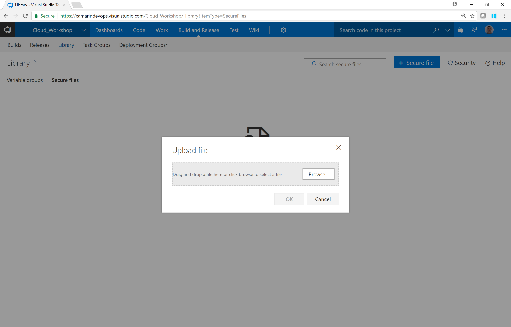

0. [Setup](../00_Setup/)
1. [Apps & Organizations](../01_Apps_&_Organizations)
2. [Visual Studio App Center SDK & Analytics](../02_Visual_Studio_App_Center_SDK_&_Analytics)
3. [Build & Distribution](../03_Build_&_Distribution)
4. [Custom Events & Crashes](../04_Custom_Events_&_Crashes)
5. [Automated Testing](../05_Automated_Testing)
6. [Push Notifications](../06_Push_Notifications)
7. Visual Studio Team Services Build
8. [Visual Studio Team Services Release](../08_Visual_Studio_Team_Services_Release)

# Exercise 07: Visual Studio Team Services Build
_Duration: 45 minutes_

In this exercise you will recreate the Visual Studio App Center build in Visual Studio Team Services.  This will give you more control and flexibility over your mobile build although it does require some additional work.  You will also create a build for your backend Azure services.

## Task1: Recreate the mobile build for your chosen platform

Navigate to your Visual Studio Team Services project and select the Build and Release hub.
Create a new build definition for the DevOps branch in your project targeting Xamarin Android/iOS

Remove the following tasks

* Xamarin Component Restore
* Xamarin Test Cloud

### Android

#### Process

* Agent Queue = Hosted MacOS preview (iOS or Android)
* Solution to restore packages = ContosoMaintenance.sln
* App File = $(build.binaresdirectiry)/$(BuildConfiguration)/com.microsoft.gbb.contosomaintenance.apk

#### Build Xamarin.Android Project

* Project = Mobile/Droid/ContosoFieldService.Droid.csproj

#### Build Test

* Project Mobile/UITests/ContosoFieldService.UITests.csproj

### iOS

#### Process

* Agent Queue = Hosted MacOS preview (iOS or Android)
* Solution to restore packages = ContosoMaintenance.sln
* App File = $(build.binaresdirectiry)/$(BuildConfiguration)/com.microsoft.gbb.contosomaintenance.ipa

**[TODO]**

Save & Queue the build.

**Note** - A completed build definition can be imported to your team project from the Builds directory

**[TODO]** 

## Task2: Add certificates to secure file library

In the Visual Studio Navigate to **Build and Release – Library – Secure Files**

Click **+Secure File** and choose the required files to sign the app for your chosen platform (Android:.keystore/iOS:.mobileprovision,.p12) 

## Task 3: Add Tasks

Some Tasks can be added by clicking the + button next to Phase 1 but others can be downloaded from the Visual Studio Marketplace

* [Mobile App Tasks for iOS and Android:](https://marketplace.visualstudio.com/items?itemName=vs-publisher-473885.motz-mobile-buildtasks)
* Download Secure File
* App Center Test (needs to be enabled)

The order of your build should look like this:

### Android

* NuGet Tool Installer
* NuGet
* Android Manifest Version Numbers
* Xamarin Android
* MSBuild
* Download Secure File
* Android Signing
* App Center Test

### iOS

* Download Secure File
* Download Secure File
* iOS Bundle Version Numbers
* Xamarin.iOS
* MSBuild
* App Center Test
* Copy Files
* Publish Build Artifacts

Save & Queue the build and switch to App Center Test to view the test results.

## [Optional] Task 4: Tokenise the build

In this step we will use VSTS build parameters to substitute the App Center App Secret at build time.
There are many tasks in the marketplace to help with Tokenization

* [Replace Tokens](https://marketplace.visualstudio.com/items?itemName=qetza.replacetokens)
* [Tokenizer](https://marketplace.visualstudio.com/items?itemName=4tecture.Tokenizer)
* [Total ALM Tokenization](https://marketplace.visualstudio.com/items?itemName=TotalALM.totalalm-tokenization)
* [Colin's ALM Corner Build & Release Tools](https://marketplace.visualstudio.com/items?itemName=colinsalmcorner.colinsalmcorner-buildtasks) (Personally, I use this one)

The core concept is described here: [Using VSTS Release with tokenisation to deploy websites](http://blogs.ripple-rock.com/rorystreet/2015/11/25/UsingVSTSReleaseWithTokenisationToDeployWebsites.aspx)

## Task 5: Create a backend build

* New build definition
* Choose Azure Web App
* Remove the task Azure App Service Deploy - we will deploy through a Release definition
* Update Process
    * Agent Queue = Hosted VS2017
    * Solution to restore packages = ContosoMaintenance.sln
    * Azure Subscrpition = Associate your Azure subscription details
* Variables tab
    * Set build configuration to ReleaseBackend
* Save & Queue

[Continuous Integration using Visual Studio Team Services](https://almvm.azurewebsites.net/labs/vsts/continuousintegration)